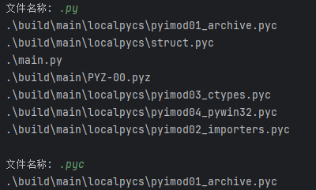

# 文件探秘者-FileSeeker

> 我才13岁所有开发能力，谢谢浏览项目，希望可以留下一个**[Stars](https://github.com/CodesPlex/FileSeeker)**谢谢！

## 项目介绍

FileSeeker(文件探秘者) 是一个根据文件名称查找搜索Python3小工具，希望留下一个Stars谢谢！

## 使用场景

1.在某个文件夹里面搜索，不搜索文件夹外的文件

2.使用并发的方法来搜索文件

3.命令行类型的工具

4.因为是命令行工具所有可以在Linux中所有

## 目录结构

- doc  项目资源存储文件夹
- .gitignore 项目忽略文件
- build.sh 项目打包脚本
- mian.py 项目核心文件
- README.md 项目介绍文件
- requirements.txt 第三方库

## 项目使用

### 安装环境

执行代码：

~~~~sh
pip install -r requirements.txt
~~~~

### Python3 运行

执行代码：

~~~sh
python main.py
~~~

### 打包运行

**双击**或者**执行代码**（根据**操作系统**选择）

~~~sh
sh build.sh
~~~

## 项目思路

## 开源协议

**[Apache-2.0 license](https://github.com/CodesPlex/FileSeeker)**

**谢谢你的浏览**
